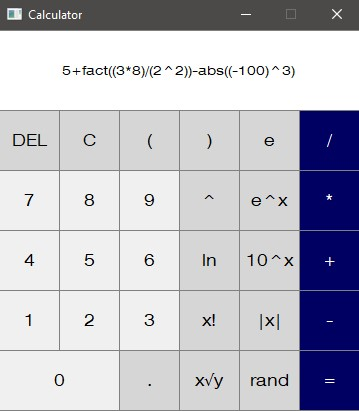

<div align="center">
    <h1>Calculator</h1>
    <p>IVS Project 2</p>
    <p>2020/2021</p>
    <p>
    
    <br>
    </p>
</div>

## Getting Started

If you want to play with code yourself clone this repository like this
```
git clone https://github.com/Matesxs/ivs_calculator_test_repository
```

## Tools

* [Python](https://www.python.org/)
* [PyQt](https://wiki.python.org/moin/PyQt)

## Authors

* **Martin Douša**
* **Ondřej Sláma**
* **Vojtěch Schindler**

## License

This project is licensed under the GNU GPL v.3 License.